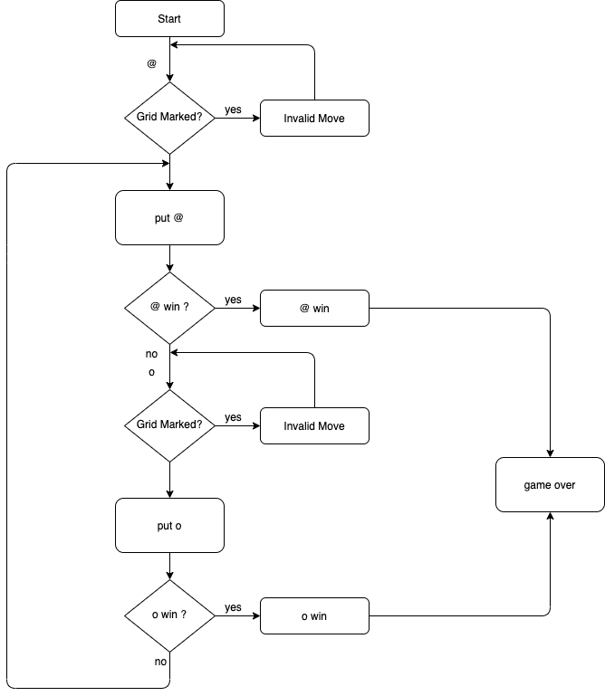

# five_in_a_row
## Ref:
https://codereview.stackexchange.com/questions/210788/gomoku-game-in-ruby
https://github.com/rasefon/gobang
https://zhuanlan.zhihu.com/p/39527867
## Repository

## Software Development Plan 
Five in a row app is traditionally played with Go pieces (black and white stones) on a Go board. 
Because pieces are typically not moved or removed from the board, five_in_a_row may also be played as a paper-and-pencil game. 

Players alternate turns placing a stone of their color on an empty intersection. The winner is the first player to form an unbroken chain of five stones horizontally, vertically, or diagonally.

People in many countries have different nicknames for five in a row. For example, Koreans call gomoku "lover's chess", indicating that playing gomoku between lovers can increase emotional communication; Europeans call it "gentleman's chess", which represents playing The gentleman's demeanor of five in a row is better than that of a gentleman; the Japanese call it "middle-aged chess", which shows that five in a row is suitable for the physiological characteristics and thinking style of middle-aged and elderly people.

Five in a row seems to only need to form a five-piece renju, but it includes expansion, connection, point selection, etc., which is hard to say. The improvement of thinking ability in chess is different from special learning courses. In other words, five in a row has a more obvious and lasting effect on the development of people's intelligence and the improvement of thinking ability, which can benefit a lifetime.
Five in a roll can also promote our ability to develop "multi-directional plane thinking". In the process of playing chess, we will predict the opponent's position in multiple directions, analyze our own response methods one by one, and carefully consider the possibility of consecutive fives.

I developed this game because it is one of the traditional Asian games and it is easy to use. In addition, I can develop successfully with my existing code writing level。

Its main audiences are students and the elderly, those who like to play some casual games or kill time。

How to use this app: Two users use two types of symble--@ and O, which represent black and white pieces, respectively, and take turns to input coordinates such as (1, 1) to place the pieces in the corresponding grid on the chessboard. The player who meets the victory criteria first wins.

## Features
When the first player finishes playing chess, it will switch to the second player

Every step will be checked with every grid on the board

If the player marks the symbol outside the grid or the marked grid, it will display "invalid move”

## Structures
five_in_row: mainly used to run games
board: mainly used to draw the grid and refresh each time
move: used to fill in pieces and switch users 
check_for_win: used to judge whether to win or draw

## Flow chart and loop

## User Interaction
Start is a welcome interface for users, and the interactivity is reflected in some visual effects. In addition, the menu design allows users to choose to play and exit the game.

The printboard provides users with a simple and convenient chessboard. There are numbers on the top and left side of the chessboard to mark the corresponding rows and columns, which is convenient for the user to judge which grid to put the chess piece into when making each move.

The design of player_move is to let users move. And when one user finishes the action, no other actions are needed, and it directly switches to the next user’s turn.

check_for_winner will show that the user wins when the user meets the victory conditions.

When the user places a chess piece outside the chessboard or a grid with chess pieces, the system displays "invalid move".

## Implementation Plan
### Player Switch
1. player 1 @
2. player 2 o
3. Use if statements to switch players
4. grid[row][col] = player
5. board & grid

### Check every move and win conditions
1. five_in_line
2. five_in_column
3. five_in_right_oblique
4. five_in_left_oblique
5. define the content of the judgment condition
6. the grid obtained by each move will be compared with each grid on the chessboard

### Error Handling
1. whether the move is marked
2. whether the moove is out of the board
3. whether the order correct
4. Show winning after winning
5. Wrong movement shows invalid movement

## How to use and install
1. Please pull the folder to your local device through the corresponding link in the GitHub repository mentioned above.

2. Please make sure your computer can run ruby program, if not, please improve the local environment.

3. Please install the corresponding gem components mentioned in "gemfile.lock" and make sure the version is consistent with the text.

4. Please run the file named "start.rb" in the terminal.

5. After running the program, it will display a menu, the contents of the menu include start the game and exit

6. After starting the game, the rules of the game and the board will be displayed. The first player uses @ as the pawn by default, and the second player uses O as the pawn by default

